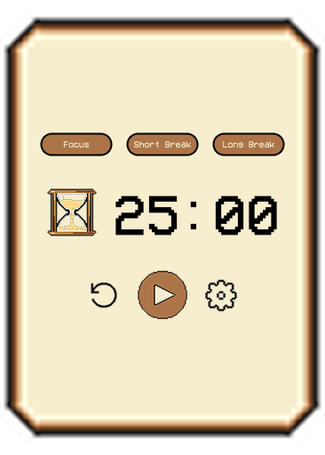
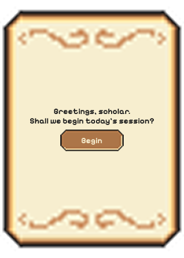

# 📜 Scholar Hour

A medieval-themed Pomodoro timer for Windows, built with Tauri + TypeScript.

---

## What is it?

Scholar Hour is a desktop productivity timer based on the [Pomodoro Technique](https://en.wikipedia.org/wiki/Pomodoro_technique) — work in focused sessions, take short breaks, stay sharp.

Dressed up in pixel art and parchment because why not.

## Features

- ⚔️ Focus, Short Break, and Long Break modes
- 🔔 Native Windows notifications when a session ends
- ⚙️ Customizable session durations
- 🔄 Auto-updates — new versions install automatically
- 🏰 Pixel art UI

## Download

Head to [Releases](../../releases) and download the latest `.exe` installer.

No install required — just run it.

## Screenshots

| Start | Timer |
|-------|-------|
|  |  |

## Built with

- [Tauri](https://tauri.app/) — lightweight desktop app framework
- TypeScript + Vite
- Pixel art assets + CSS

---

*"Greetings, scholar. Shall we begin?"*
